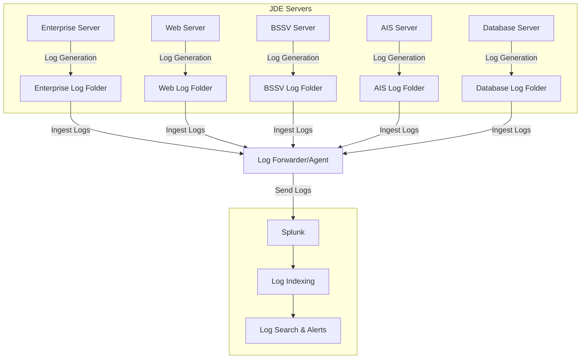

## Logging in Legacy Systems: Sending JDE Logs to Splunk and Graylog

### Introduction
Why logging matters in legacy systems
Challenges of working with predefined log file locations
Overview of Splunk and Graylog as log management solutions
What the post covers: Installation, setup, agents/sidecars, log analysis, and alerting

### Architecture




### The Necessity of Log Analysis
Why log analysis is crucial for operations and development
Common problems in legacy systems that logs help diagnose
Alerting and monitoring for proactive issue resolution

### Overview of Splunk and Graylog
Comparison of both tools
Splunk: Proprietary, powerful search, machine learning, scalability
Graylog: Open-source, flexible, cost-effective
Use case suitability for JDE logs

### Installing and Setting Up Splunk
Installation steps (self-hosted vs. cloud)

#### Install splunk in docker

[https://github.com/jdedev/tophomelab/tree/main/docker/splunk](https://github.com/jdedev/tophomelab/tree/main/docker/splunk)

> docker-compose.yml

```yaml
services:
  splunk:
    image: ${SPLUNK_IMAGE:-splunk/splunk:latest}
    container_name: splunk
    restart: always    
    environment:
      - SPLUNK_START_ARGS=--accept-license
      - SPLUNK_HEC_TOKEN=${SPLUNK_HEC_TOKEN}
      - SPLUNK_PASSWORD=${SPLUNK_PASSWORD}
    ports:
      - 8000:8000
      - 8088:8088
      - 8089:8089
    volumes:
      - "./splunk/etc:/opt/splunk/etc"
      - "./splunk/var:/opt/splunk/var"
```

#### New Index 


#### Search the new index


JDE Logs folder


jde.log file contents


login to jde
to generate some logs


Find an address book record


Find an address book record


Edit address book record


Address book record updated


Locate log messages 


Review messages in the proximity


Messages - log file records


Add data - Add input


New Index


Configuring log inputs for text file ingestion


Setting up alerts and dashboards

### Installing and Setting Up Graylog
Installation steps (self-hosted vs. cloud)

#### Install Graylog in docker

> https://github.com/jdedev/tophomelab/tree/main/docker/graylog

```yaml
networks:
  graynet:
    driver: bridge

services:
  # Graylog stores configuration in MongoDB
  mongo:
    image: mongo:6.0.5-jammy
    container_name: mongodb
    volumes:
      - "./mongo/mongo_data:/data/db"
    networks:
      - graynet
    restart: unless-stopped

  # The logs themselves are stored in Opensearch
  opensearch:
    image: opensearchproject/opensearch:2
    container_name: opensearch
    environment:
      - "OPENSEARCH_JAVA_OPTS=-Xms1g -Xmx1g"
      - "bootstrap.memory_lock=true"
      - "discovery.type=single-node"
      - "action.auto_create_index=false"
      - "plugins.security.ssl.http.enabled=false"
      - "plugins.security.disabled=true"
      - "OPENSEARCH_INITIAL_ADMIN_PASSWORD=SetPassw0rdL3ttersAndNumb3r5"
    volumes:
      - "./opensearch:/usr/share/opensearch/data"
    ulimits:
      memlock:
        soft: -1
        hard: -1
      nofile:
        soft: 65536
        hard: 65536
    ports:
      - 9200:9200/tcp
    networks:
      - graynet
    restart: unless-stopped

  graylog:
    image: graylog/graylog:6.1
    container_name: graylog
    environment:
      # CHANGE ME (must be at least 16 characters)!
      GRAYLOG_PASSWORD_SECRET: ${GRAYLOG_PASSWORD_SECRET}
      # Password: admin
      GRAYLOG_ROOT_PASSWORD_SHA2: ${GRAYLOG_ROOT_PASSWORD_SHA2}
      GRAYLOG_HTTP_BIND_ADDRESS: "0.0.0.0:9000"
      GRAYLOG_HTTP_EXTERNAL_URI: "http://localhost:9000/"
      GRAYLOG_ELASTICSEARCH_HOSTS: "http://opensearch:9200"
      GRAYLOG_MONGODB_URI: "mongodb://mongodb:27017/graylog"
      GRAYLOG_TIMEZONE: "America/Detroit"
      TZ: "America/Detroit"
      GRAYLOG_TRANSPORT_EMAIL_PROTOCOL: "smtp"
      GRAYLOG_TRANSPORT_EMAIL_WEB_INTERFACE_URL: "http://192.168.3.233:9000/"
      GRAYLOG_TRANSPORT_EMAIL_HOSTNAME: "outbound.mailhop.org"
      GRAYLOG_TRANSPORT_EMAIL_ENABLED: "true"
      GRAYLOG_TRANSPORT_EMAIL_PORT: "587"
      GRAYLOG_TRANSPORT_EMAIL_USE_AUTH: "true"
      GRAYLOG_TRANSPORT_EMAIL_AUTH_USERNAME: "xxxxx"
      GRAYLOG_TRANSPORT_EMAIL_AUTH_PASSWORD: "xxxxx"
      GRAYLOG_TRANSPORT_EMAIL_USE_TLS: "true"
      GRAYLOG_TRANSPORT_EMAIL_USE_SSL: "false"
      GRAYLOG_TRANSPORT_FROM_EMAIL: "graylog@example.com"
      GRAYLOG_TRANSPORT_SUBJECT_PREFIX: "[graylog]"

    entrypoint: /usr/bin/tini -- wait-for-it opensearch:9200 -- /docker-entrypoint.sh
    volumes:
      - "./graylog.conf:/usr/share/graylog/data/config/graylog.conf"
      - "./graylog/data:/usr/share/graylog/data"
    networks:
      - graynet
    restart: always
    depends_on:
      opensearch:
        condition: "service_started"
      mongo:
        condition: "service_started"
    ports:
      - 9000:9000/tcp   # Graylog web interface and REST API
      - 1514:1514/tcp   # Syslog
      - 1514:1514/udp   # Syslog
      - 12201:12201/tcp # GELF
      - 12201:12201/udp # GELF
```

#### Install and configure Filebeat

> Filebeat Lightweight shipper for logs - pull logs from text files  

> [https://www.elastic.co/downloads/beats/filebeat](https://www.elastic.co/downloads/beats/filebeat)

#### Configuring Filebeat


Setting up dashboards and alerts

### Configuring Log Forwarding from JDE
Challenges of JDE logging and file-based log storage
Using Splunk Universal Forwarder for Splunk
Using Graylog Sidecar & Filebeat for Graylog
Best practices for efficient log collection

### Log Analysis: Improving Operations and Development
Searching logs efficiently
Setting up alerts for proactive issue detection
How logs help in troubleshooting and debugging
Using logs to improve performance and security

### Conclusion
Summary of findings
Pros and cons of Splunk vs. Graylog for legacy logs
Next steps: Automating log insights and further enhancements


### file logs

> .

## misc

### infra

domain
> jde92sa.tophomelab.work

Hosts  
- traefik.jde92sa.tophomelab.work : 10.0.6.203  
    - Services:  
        - traefik  
        - portainer  
        - cf-jde92sa  
- graylog.jde92sa.tophomelab.work : 10.0.6.201  
    - graylog
- splunk.jde92sa.tophomelab.work : 10.0.6.202  
    - splunk


Reference  
- jde92sa : 10.0.5.90


```shell
splunk
    curl -k "https://localhost:8088/services/collector" \
    -H "Authorization: Splunk 9fbb05c6-0f85-46af-bc76-5fa07c3baec3" \
    -d '{"event": "Hello, world!", "sourcetype": "manual"}'


graylog
    echo -e '{"version": "1.1","host":"example.org","short_message":"Short message","full_message":"Backtrace here\n\nmore stuff","level":1,"_user_id":9001,"_some_info":"foo","_some_env_var":"bar"}\0' | nc -u -w 1 localhost 12201

```


